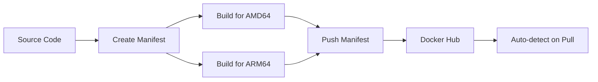

# Multi-Architecture Docker Deployment Guide

## 🌍 Overview

This guide explains how to build and deploy Docker images that support multiple CPU architectures:
- **linux/amd64** - Intel/AMD x86_64 processors (most servers)
- **linux/arm64** - ARM64 processors (Apple Silicon, ARM servers, Raspberry Pi 4+)

## ✨ Benefits

### Why Multi-Architecture?

1. **Flexibility** - Same image works on different hardware
2. **Performance** - Native execution (no emulation overhead)
3. **Future-proof** - Support for ARM servers (AWS Graviton, etc.)
4. **Development** - Build on Mac M1/M2/M3, deploy anywhere

### Auto-Detection

Docker/Podman automatically pulls the correct architecture:
```bash
# On x86_64 server → pulls amd64 image
docker pull docker.io/daikonsushi/bot-platform:latest

# On ARM64 server → pulls arm64 image  
docker pull docker.io/daikonsushi/bot-platform:latest
```

## 🚀 Quick Start

### Build Multi-Architecture Images

Simply run the updated build script:

```bash
./build-and-push.sh
```

This will:
1. ✅ Create a manifest (multi-arch image list)
2. ✅ Build for linux/amd64 (x86_64)
3. ✅ Build for linux/arm64 (ARM64)
4. ✅ Push manifest to Docker Hub
5. ✅ Auto-detection works on any platform

### Deploy on Any Architecture

On your server (x86_64 or ARM64):

```bash
# Using docker-compose (recommended)
docker-compose pull bot-platform
docker-compose up -d bot-platform

# Or using docker directly
docker pull docker.io/daikonsushi/bot-platform:latest
docker run -d --name bot-platform \
  -p 8080:8080 -p 50051:50051 \
  -v ./config.yaml:/app/config.yaml \
  docker.io/daikonsushi/bot-platform:latest
```

Docker will automatically select the correct architecture!

## 🔧 Configuration

### Build Script Configuration

Edit [`build-and-push.sh`](../build-and-push.sh):

```bash
# Multi-architecture (default)
PLATFORMS="linux/amd64,linux/arm64"

# Single architecture options:
# PLATFORMS="linux/amd64"   # x86_64 only
# PLATFORMS="linux/arm64"   # ARM64 only
```

### Supported Platforms

| Platform | Description | Use Case |
|----------|-------------|----------|
| `linux/amd64` | Intel/AMD x86_64 | Most cloud servers, VPS |
| `linux/arm64` | ARM 64-bit | Apple Silicon, AWS Graviton, ARM servers |
| `linux/arm/v7` | ARM 32-bit | Raspberry Pi 3 (not recommended) |

**Note**: We focus on amd64 and arm64 as they cover 99% of use cases.

## 📊 Build Process

### How It Works



### Build Steps

1. **Create Manifest**
   ```bash
   podman manifest create docker.io/daikonsushi/bot-platform:latest
   ```

2. **Build for Each Architecture**
   ```bash
   # AMD64
   podman build --platform linux/amd64 \
     --manifest docker.io/daikonsushi/bot-platform:latest \
     -f Dockerfile .
   
   # ARM64
   podman build --platform linux/arm64 \
     --manifest docker.io/daikonsushi/bot-platform:latest \
     -f Dockerfile .
   ```

3. **Push Manifest**
   ```bash
   podman manifest push docker.io/daikonsushi/bot-platform:latest
   ```

## 🔍 Verification

### Inspect Manifest

Check which architectures are available:

```bash
# Using podman
podman manifest inspect docker.io/daikonsushi/bot-platform:latest

# Using docker
docker buildx imagetools inspect docker.io/daikonsushi/bot-platform:latest
```

Expected output:
```json
{
  "manifests": [
    {
      "platform": {
        "architecture": "amd64",
        "os": "linux"
      }
    },
    {
      "platform": {
        "architecture": "arm64",
        "os": "linux"
      }
    }
  ]
}
```

### Test on Different Architectures

```bash
# Force pull specific architecture
docker pull --platform linux/amd64 docker.io/daikonsushi/bot-platform:latest
docker pull --platform linux/arm64 docker.io/daikonsushi/bot-platform:latest

# Check image architecture
docker inspect docker.io/daikonsushi/bot-platform:latest | grep Architecture
```

## 📈 Performance Comparison

### Build Time (on Mac M3)

| Architecture | Build Time | Notes |
|--------------|------------|-------|
| ARM64 (native) | ~30s | Native compilation |
| AMD64 (cross) | ~2-3min | QEMU emulation |

### Runtime Performance

| Architecture | Performance | Notes |
|--------------|-------------|-------|
| Native (amd64 on x86) | 100% | No overhead |
| Native (arm64 on ARM) | 100% | No overhead |
| Emulated | 10-50% | Avoid in production |

**Key Point**: Always use native architecture in production!

## 🎯 Deployment Scenarios

### Scenario 1: x86_64 Production Server

```bash
# docker-compose.yaml (no changes needed)
services:
  bot-platform:
    image: docker.io/daikonsushi/bot-platform:latest
    # Docker auto-selects amd64 variant
```

### Scenario 2: ARM64 Server (AWS Graviton)

```bash
# Same docker-compose.yaml
services:
  bot-platform:
    image: docker.io/daikonsushi/bot-platform:latest
    # Docker auto-selects arm64 variant
```

### Scenario 3: Mixed Architecture Cluster

```yaml
# Kubernetes deployment
apiVersion: apps/v1
kind: Deployment
metadata:
  name: bot-platform
spec:
  replicas: 3
  template:
    spec:
      containers:
      - name: bot-platform
        image: docker.io/daikonsushi/bot-platform:latest
        # Kubernetes schedules on any node
        # Image auto-selects correct architecture
```

## 🐛 Troubleshooting

### Issue: "exec format error"

**Cause**: Running wrong architecture binary.

**Solution**: 
```bash
# Check current architecture
uname -m
# x86_64 = amd64
# aarch64 = arm64

# Verify image architecture
docker inspect docker.io/daikonsushi/bot-platform:latest | grep Architecture

# Force correct architecture
docker pull --platform linux/$(uname -m) docker.io/daikonsushi/bot-platform:latest
```

### Issue: Slow build on Mac M3

**Cause**: Cross-compiling to amd64 uses QEMU emulation.

**Solution**: This is normal. The Dockerfile is optimized:
- Go dependencies downloaded natively (fast)
- Only final compilation is cross-compiled
- Expected time: 2-3 minutes for amd64

### Issue: Manifest push fails

**Cause**: Manifest already exists or authentication issue.

**Solution**:
```bash
# Remove old manifest
podman manifest rm docker.io/daikonsushi/bot-platform:latest

# Re-login to Docker Hub
podman login docker.io

# Rebuild
./build-and-push.sh
```

### Issue: Wrong architecture pulled

**Cause**: Docker cache or explicit platform specification.

**Solution**:
```bash
# Clear cache
docker system prune -a

# Pull without cache
docker pull --no-cache docker.io/daikonsushi/bot-platform:latest

# Verify
docker inspect docker.io/daikonsushi/bot-platform:latest | grep Architecture
```

## 📚 Advanced Topics

### Custom Architecture Selection

Force specific architecture in docker-compose:

```yaml
services:
  bot-platform:
    image: docker.io/daikonsushi/bot-platform:latest
    platform: linux/amd64  # Force amd64 (not recommended)
```

### Build for Additional Architectures

Add more platforms to build script:

```bash
# Include ARM v7 (32-bit)
PLATFORMS="linux/amd64,linux/arm64,linux/arm/v7"
```

**Note**: Requires updating Dockerfile for 32-bit support.

### CI/CD Integration

GitHub Actions example:

```yaml
- name: Set up QEMU
  uses: docker/setup-qemu-action@v2

- name: Set up Docker Buildx
  uses: docker/setup-buildx-action@v2

- name: Build and push
  uses: docker/build-push-action@v4
  with:
    platforms: linux/amd64,linux/arm64
    push: true
    tags: daikonsushi/bot-platform:latest
```

## 🔐 Security Considerations

1. **Verify Architectures** - Always inspect manifest before deploying
2. **Pin Versions** - Use specific tags in production
3. **Scan Images** - Run security scans for each architecture
4. **Test Both** - Test on both amd64 and arm64 before release

## 📊 Image Sizes

| Architecture | Compressed | Uncompressed |
|--------------|------------|--------------|
| linux/amd64 | ~23 MB | ~65 MB |
| linux/arm64 | ~22 MB | ~63 MB |
| **Total Manifest** | ~45 MB | ~128 MB |

**Note**: Docker only downloads the architecture you need!

## 🎓 Best Practices

1. **Always Build Multi-Arch** - Future-proof your deployments
2. **Test on Target** - Verify on actual hardware before production
3. **Use Manifests** - Don't create separate tags for architectures
4. **Document Requirements** - Specify minimum CPU requirements
5. **Monitor Performance** - Track metrics on different architectures

## 🔄 Update Workflow

### For Developers (Mac M3)

```bash
# 1. Make code changes
vim internal/plugins/help.go

# 2. Build and push multi-arch
./build-and-push.sh

# 3. Verify manifest
podman manifest inspect docker.io/daikonsushi/bot-platform:latest
```

### For Operators (Any Server)

```bash
# 1. Pull latest (auto-detects architecture)
docker-compose pull bot-platform

# 2. Restart service
docker-compose up -d bot-platform

# 3. Verify
docker logs -f bot-platform
```

## 📞 Support

### Common Questions

**Q: Do I need to change docker-compose.yaml?**  
A: No! Multi-arch images work with existing configurations.

**Q: Which architecture should I use?**  
A: Let Docker auto-detect. It always chooses the native architecture.

**Q: Can I mix architectures in a cluster?**  
A: Yes! Each node pulls its native architecture automatically.

**Q: Is ARM64 as stable as AMD64?**  
A: Yes! Go produces equally stable binaries for both architectures.

## 🌟 Summary

✅ **Multi-arch support is transparent** - No config changes needed  
✅ **Auto-detection works** - Docker picks the right architecture  
✅ **Performance is native** - No emulation overhead  
✅ **Future-proof** - Ready for ARM servers  
✅ **Easy to build** - Just run `./build-and-push.sh`

---

**Ready to deploy on any architecture! 🚀**
