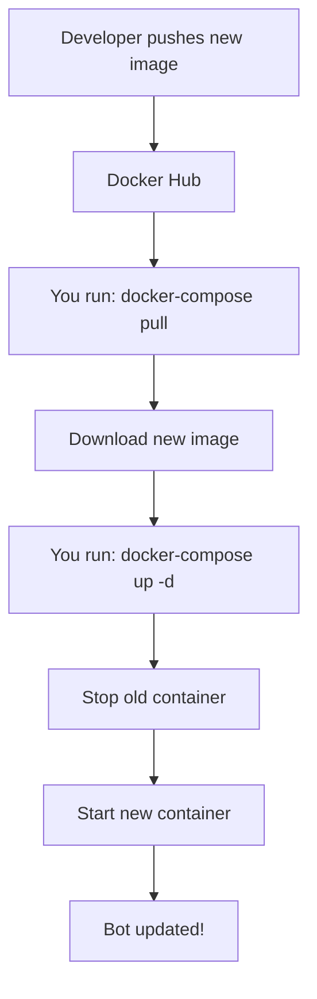

# Docker Compose Update Guide

## ✅ Yes, Your Existing Setup Will Auto-Update!

If you've already deployed using `docker-compose.yaml`, updating is **super simple**!

## 🚀 Quick Update (3 Commands)

On your Linux server where docker-compose is running:

```bash
# 1. Pull the latest image
docker-compose pull bot-platform

# 2. Restart the service with new image
docker-compose up -d bot-platform

# 3. Verify it's running
docker-compose logs -f bot-platform
```

That's it! ✨

---

## 📋 Detailed Update Process

### Step 1: Check Current Status

```bash
# See what's running
docker-compose ps

# Check current image version
docker images | grep bot-platform
```

### Step 2: Pull Latest Image

```bash
# Pull only bot-platform (faster)
docker-compose pull bot-platform

# Or pull all services
docker-compose pull
```

**What happens:**
- Docker connects to Docker Hub
- Downloads `docker.io/daikonsushi/bot-platform:latest`
- Auto-detects your CPU architecture (amd64 or arm64)
- Only downloads layers that changed (efficient!)

### Step 3: Restart Service

```bash
# Restart only bot-platform (recommended)
docker-compose up -d bot-platform

# Or restart all services
docker-compose up -d
```

**What happens:**
- Stops old container
- Creates new container with new image
- Preserves volumes (config, plugins)
- Starts new container
- Old container is removed

### Step 4: Verify Update

```bash
# Check logs
docker-compose logs -f bot-platform

# Check if container is running
docker ps | grep bot-platform

# Test the bot
# Send /help to your QQ bot
```

---

## 🔄 Update Workflow Diagram



---

## 🎯 Your docker-compose.yaml Configuration

Your current setup:

```yaml
bot-platform:
  image: docker.io/daikonsushi/bot-platform:latest  # ← Always pulls latest
  container_name: bot-platform
  volumes:
    - ./bot-platform/plugins-bin:/app/plugins-bin      # ← Preserved
    - ./bot-platform/plugins-config:/app/plugins-config # ← Preserved
    - ./bot-platform/config.yaml:/app/config.yaml       # ← Preserved
  restart: unless-stopped
```

**Key Points:**
- ✅ `image: ...latest` - Always gets newest version
- ✅ Volumes are preserved - Your data is safe
- ✅ Config is mounted - Changes persist
- ✅ `restart: unless-stopped` - Auto-restarts on reboot

---

## 📊 What Gets Updated vs Preserved

### ✅ Updated (New Image)
- Bot platform binary
- Built-in plugins (help, etc.)
- Dependencies
- Bug fixes
- New features

### ✅ Preserved (Volumes)
- Your `config.yaml` settings
- External plugins in `plugins-bin/`
- Plugin configs in `plugins-config/`
- All your customizations

---

## 🔍 Verification Commands

### Check Image Version

```bash
# See image creation date
docker images docker.io/daikonsushi/bot-platform:latest

# Inspect image details
docker inspect docker.io/daikonsushi/bot-platform:latest | grep Created
```

### Check Container Status

```bash
# List running containers
docker-compose ps

# Check container uptime
docker ps --format "table {{.Names}}\t{{.Status}}\t{{.Image}}"
```

### Check Logs

```bash
# Follow logs (Ctrl+C to exit)
docker-compose logs -f bot-platform

# Last 50 lines
docker-compose logs --tail=50 bot-platform

# Since 10 minutes ago
docker-compose logs --since=10m bot-platform
```

---

## 🎨 Update Scenarios

### Scenario 1: Normal Update (Recommended)

```bash
# Pull and restart in one go
docker-compose pull bot-platform && docker-compose up -d bot-platform
```

**Downtime**: ~2-5 seconds (container restart)

### Scenario 2: Zero-Downtime Update (Advanced)

```bash
# Scale to 2 instances
docker-compose up -d --scale bot-platform=2

# Wait for new instance to be healthy
sleep 10

# Scale back to 1 (removes old instance)
docker-compose up -d --scale bot-platform=1
```

**Downtime**: 0 seconds (requires load balancer)

### Scenario 3: Full Restart (All Services)

```bash
# Pull all images
docker-compose pull

# Restart everything
docker-compose down
docker-compose up -d

# Check status
docker-compose ps
```

**Downtime**: ~10-30 seconds (all services restart)

### Scenario 4: Rollback to Previous Version

```bash
# Use date-tagged version
docker pull docker.io/daikonsushi/bot-platform:20260101

# Update docker-compose.yaml temporarily
# image: docker.io/daikonsushi/bot-platform:20260101

# Restart
docker-compose up -d bot-platform
```

---

## 🔔 Update Notifications

### Manual Check

```bash
# Check for new images
docker-compose pull --dry-run bot-platform 2>&1 | grep "Downloaded newer"
```

### Automated Updates (Optional)

Use [Watchtower](https://containrrr.dev/watchtower/) for auto-updates:

```yaml
# Add to docker-compose.yaml
watchtower:
  image: containrrr/watchtower
  volumes:
    - /var/run/docker.sock:/var/run/docker.sock
  command: --interval 3600 --cleanup
  # Checks every hour, auto-updates containers
```

**Warning**: Auto-updates can be risky. Test manually first!

---

## 🐛 Troubleshooting Updates

### Issue: "Image is up to date"

**Cause**: You already have the latest version.

**Solution**: This is normal! No update needed.

```bash
# Force re-pull
docker-compose pull --no-cache bot-platform
```

### Issue: Update fails with "conflict"

**Cause**: Container is running and can't be replaced.

**Solution**:
```bash
# Stop first, then update
docker-compose stop bot-platform
docker-compose rm -f bot-platform
docker-compose pull bot-platform
docker-compose up -d bot-platform
```

### Issue: New version doesn't work

**Cause**: Breaking changes or configuration issues.

**Solution**: Rollback to previous version:
```bash
# Check available tags on Docker Hub
# https://hub.docker.com/r/daikonsushi/bot-platform/tags

# Use specific date tag
docker pull docker.io/daikonsushi/bot-platform:20260101
# Update docker-compose.yaml to use this tag
docker-compose up -d bot-platform
```

### Issue: Config changes not applied

**Cause**: Config is cached or not mounted correctly.

**Solution**:
```bash
# Verify config is mounted
docker-compose exec bot-platform cat /app/config.yaml

# Restart to reload config
docker-compose restart bot-platform
```

### Issue: Plugins disappeared

**Cause**: Volume mount issue.

**Solution**:
```bash
# Check volume mounts
docker inspect bot-platform | grep -A 10 Mounts

# Verify files exist on host
ls -la ./bot-platform/plugins-bin/
ls -la ./bot-platform/plugins-config/

# Restart with correct mounts
docker-compose down
docker-compose up -d
```

---

## 📅 Update Schedule Recommendations

### Development Environment
- **Frequency**: Every commit/push
- **Method**: `docker-compose pull && docker-compose up -d`

### Staging Environment
- **Frequency**: Daily or weekly
- **Method**: Scheduled cron job

### Production Environment
- **Frequency**: After testing in staging
- **Method**: Manual update during maintenance window
- **Best Practice**: Use date-tagged versions, not `latest`

---

## 🔐 Production Best Practices

### 1. Use Specific Tags

Instead of `latest`, use date tags:

```yaml
# docker-compose.yaml
bot-platform:
  image: docker.io/daikonsushi/bot-platform:20260101  # Specific version
```

### 2. Test Before Production

```bash
# On staging server
docker-compose pull bot-platform
docker-compose up -d bot-platform
# Test thoroughly

# On production server (after testing)
docker-compose pull bot-platform
docker-compose up -d bot-platform
```

### 3. Backup Before Update

```bash
# Backup config and plugins
tar -czf backup-$(date +%Y%m%d).tar.gz \
  bot-platform/config.yaml \
  bot-platform/plugins-bin/ \
  bot-platform/plugins-config/

# Update
docker-compose pull bot-platform
docker-compose up -d bot-platform
```

### 4. Monitor After Update

```bash
# Watch logs for errors
docker-compose logs -f bot-platform

# Check resource usage
docker stats bot-platform

# Test bot functionality
# Send /help, /plugin list, etc.
```

---

## 🎯 Quick Reference

### Common Update Commands

```bash
# Standard update
docker-compose pull bot-platform && docker-compose up -d bot-platform

# Update with logs
docker-compose pull bot-platform && docker-compose up -d bot-platform && docker-compose logs -f bot-platform

# Update all services
docker-compose pull && docker-compose up -d

# Force recreate
docker-compose up -d --force-recreate bot-platform

# Update and remove old images
docker-compose pull && docker-compose up -d && docker image prune -f
```

### Status Check Commands

```bash
# Quick status
docker-compose ps

# Detailed info
docker-compose ps -a && docker images | grep bot-platform

# Logs
docker-compose logs --tail=100 bot-platform

# Resource usage
docker stats --no-stream bot-platform
```

---

## 📞 Support

### Update Issues?

1. Check logs: `docker-compose logs bot-platform`
2. Verify image: `docker images | grep bot-platform`
3. Check mounts: `docker inspect bot-platform | grep Mounts`
4. Test config: `docker-compose config`

### Need Help?

- Check [Troubleshooting](#troubleshooting-updates) section
- Review [Docker Compose docs](https://docs.docker.com/compose/)
- Open an issue on GitHub

---

## ✨ Summary

### Your Update Process (3 Steps)

```bash
# 1. Pull latest image
docker-compose pull bot-platform

# 2. Restart service
docker-compose up -d bot-platform

# 3. Verify
docker-compose logs -f bot-platform
```

### What You Need to Know

✅ **Your setup is update-ready** - No changes needed to docker-compose.yaml  
✅ **Data is preserved** - Volumes persist across updates  
✅ **Multi-arch works** - Auto-detects your CPU architecture  
✅ **Downtime is minimal** - Only 2-5 seconds during restart  
✅ **Rollback is easy** - Use date-tagged versions if needed  

---

**Your bot platform is ready for seamless updates! 🚀**
